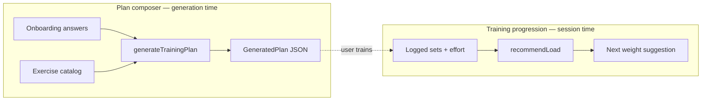

# Pacergo plan engine — product handbook

This folder is the **source of truth for how AI Plan works** — for product owners, designers, and engineers. It explains concepts in plain language, shows how pieces connect, and lists what is live vs leftover vs unfinished.

| Doc | Audience | What it answers |
| --- | --- | --- |
| [Architecture](./architecture.md) | Everyone | How a plan is born, stored, and progressed (Mermaid) |
| [Glossary](./glossary.md) | Product + eng | What every major concept means |
| [Debt & cleanup](./debt-and-cleanup.md) | Product + eng | Empty maps, dual systems, unused fields — what to fix next |
| [Design spec](../superpowers/specs/2026-10-08-progressive-mesocycle-engine-design.md) | Eng | Acceptance rules for the mesocycle upgrade |
| [Research](../../reports/Deterministic%20workout%20plan%20progression.md) | Product | Why we chose frozen skeleton + dose progression |

## One-sentence product model

> Pacergo builds a **deterministic 4-week training plan** from onboarding answers + the exercise catalog, then (on web) helps the user **progress load session-to-session** from what they logged — without an LLM inventing workouts.

## Two engines (do not conflate)



| | Composer | Live progression |
| --- | --- | --- |
| **When** | Create / refresh plan | During / after a workout |
| **Input** | Goal, experience, days, duration, equipment, catalog | Previous sets, effort feedback |
| **Output** | Full 4-week structure | Suggested next load |
| **Code** | `generate-plan.ts` + `mesocycle-rules.ts` | `progression.ts` |
| **Product surface** | Web AI Plan | Web set logger (partial) |

## Where it runs today

| Surface | Plan generator | Notes |
| --- | --- | --- |
| **Web** (`apps/web`) | `generateTrainingPlan` | Live product path |
| **Mobile** (`apps/mobile`) | `composeTrainingPlan` + authored `plan-data.ts` | **Legacy** markdown plans — different goal ids and inputs |

Keeping both is the biggest architectural smell; see [Debt & cleanup](./debt-and-cleanup.md).

## Quick commands

```bash
yarn workspace @pacergo/shared test
yarn workspace @pacergo/shared typecheck
```

Bump `PLAN_RULES_VERSION` in `generate-plan.ts` whenever generation output changes — the plan overview can offer a refresh.
