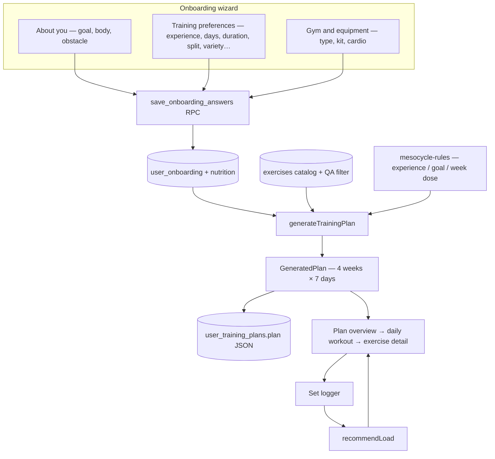
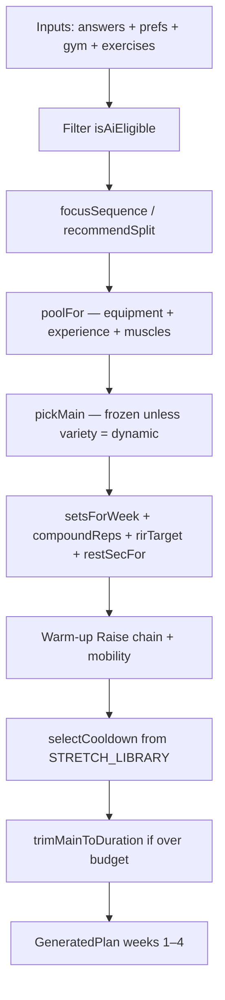
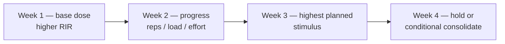
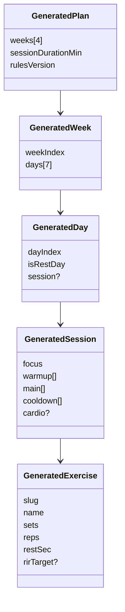
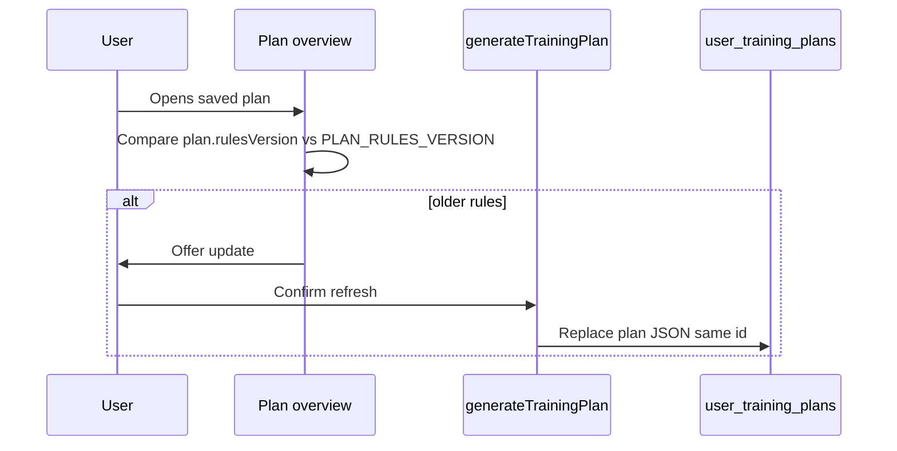

# Architecture — how a plan is made

## End-to-end (web AI Plan)

## Composer pipeline (deterministic)

Same inputs + same catalog snapshot + same `PLAN_RULES_VERSION` → **identical** plan.

### What each stage means for the product

| Stage | Product meaning |
| --- | --- |
| QA filter | Only exercises with art + instructions + muscles that passed QA |
| Split | Which days are push / pull / legs / upper / lower / full body |
| Pool | What the user can actually do with their kit and level |
| Pick | Which exercises fill the session — **stable across weeks by default** |
| Dose | Sets, reps, rest, planned RIR for that week |
| Warm-up | Easy machine Raise when cardio types exist; else mobility / short impact |
| Cool-down | Real stretches matched to muscles trained |
| Trim | Drop lowest-priority accessories if the session would overrun duration |

## Week storyboard (mesocycle)

Progression hierarchy (composer + live):

1. Keep exercises  
2. Add reps in range  
3. Add load when top of range is hit  
4. Tighten effort / RIR  
5. Add sets only if `MILD_RAMP` applies  
6. Change rest density only when the goal profile allows  

**Default is not “more sets every week.”**

## Data shapes

## Module map (code)

| Module | Responsibility |
| --- | --- |
| `generate-plan.ts` | Orchestrates the composer |
| `mesocycle-rules.ts` | Experience tables, goal profiles, volume curves, warm-up Raise |
| `exercise-fit.ts` | Rank / restrict exercises by experience and modality |
| `exercise-meta.ts` | Isolation / timed / difficulty / advanced-skill lists |
| `exercise-qa.ts` | Hard exclude list for bad art/instructions |
| `stretch-library.ts` | Cool-down stretch picks |
| `split-recommendation.ts` | Suggested split from answers |
| `progression.ts` | Live load recommendation |
| `plan-inputs.ts` | Signature / refresh when profile changes |
| `plan-composer.ts` + `plan-data.ts` | **Legacy mobile** authored plans |
| `apps/web/src/lib/plans.ts` | Save / refresh / activate plans against Supabase |

## Versioning & refresh

Logged workouts stay attached to the plan id when the active plan is regenerated from the fitness profile (`refreshActivePlanFromProfile`).
