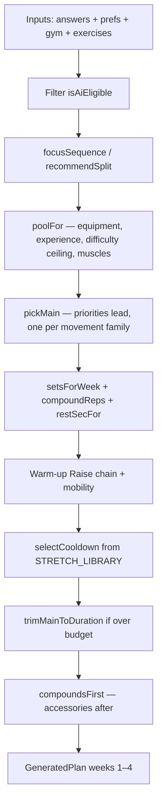
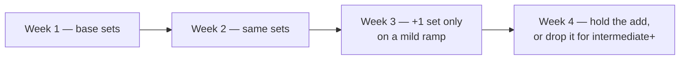
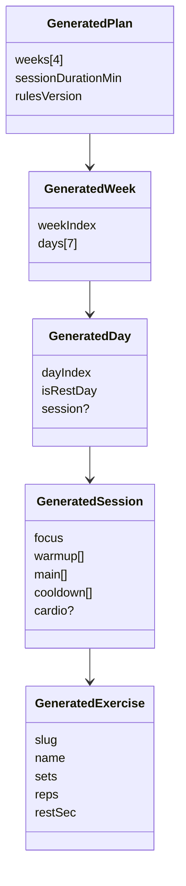
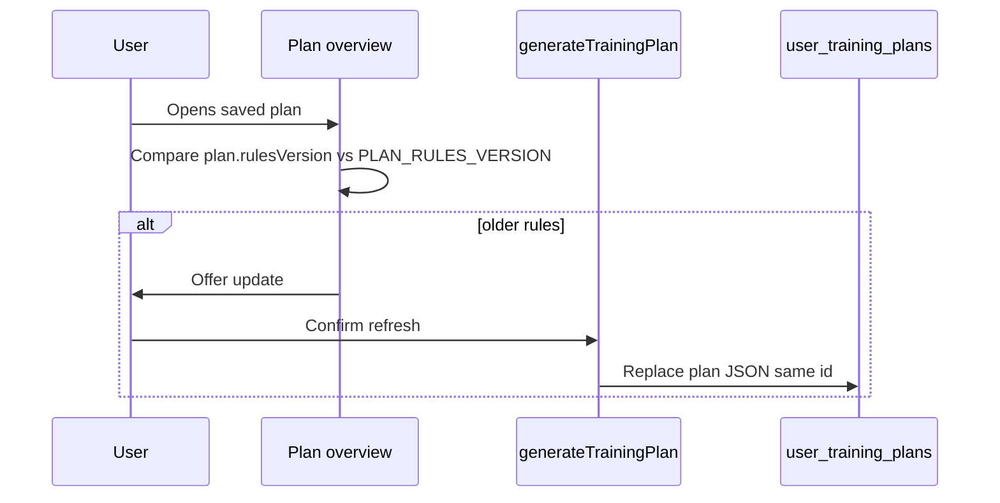

# Architecture — how a plan is made

## End-to-end (web AI Plan)

```mermaid
flowchart TB
  subgraph Onboarding["Onboarding wizard"]
    O1[About you — goal, body, obstacle]
    O2[Training preferences — experience, days, duration, split, variety…]
    O3[Gym and equipment — type, kit, cardio]
  end

  O1 --> Save[save_onboarding_answers RPC]
  O2 --> Save
  O3 --> Save
  Save --> Profile[(user_onboarding + nutrition)]
  Save --> Public[(users.experience_level)]

  Profile --> Gen[generateTrainingPlan]
  Catalog[(exercises catalog + QA filter)] --> Gen
  Rules[mesocycle-rules — experience / goal / week dose] --> Gen

  Gen --> PlanJSON[GeneratedPlan — 4 weeks × 7 days]
  PlanJSON --> DB[(user_training_plans.plan JSON)]
  PlanJSON --> UI[Plan overview → daily workout → exercise detail]

  UI --> Log[Set logger]
  Log --> Rec[recommendSessionProgression]
  Rec --> UI
```

The plan reads `training_preferences.experience`. The same save also writes `users.experience_level`, with different words for the first two picks. See [Glossary → People & levels](./glossary.md#people--levels).

| Pick | Plan answer | Public column |
| --- | --- | --- |
| Beginner | `no_experience` | `beginner` |
| Basic | `basic` | `basic` |
| Intermediate | `intermediate` | `intermediate` |
| Advanced | `advanced` | `advanced` |

## Composer pipeline (deterministic)

Same inputs + same catalog snapshot + same `PLAN_RULES_VERSION` → **identical** plan.

### What each stage means for the product

| Stage | Product meaning |
| --- | --- |
| QA filter | Only exercises with art + instructions + muscles that passed QA |
| Split | Which days are push / pull / legs / upper / lower / full body |
| Pool | What the user can actually do with their kit and level (including the difficulty ceiling below) |
| Pick | Which exercises fill the session. `fixed` variety repeats week 1 all month; `balanced` (default) and `dynamic` step each muscle's lead lift up the equipment ladder (machine → free weight → barbell) week by week, and rotate emphasis when the same focus repeats in a week |
| Dose | Sets, reps, and rest for that week |
| Warm-up | Raise (easy machine when cardio types exist, else short impact or none) plus one drill matched to the day's focus — exactly 2 moves (client rule) |
| Cool-down | Real stretches matched to muscles trained |
| Trim | Drop lowest-priority accessories if the session would overrun duration |
| Order | Compound lifts first, accessories (single-joint work, core, grip) after — selection and trimming already happened, this only sets the running order |

## Guard rails — what the generator refuses to do

These exist because each one was a real, wrong plan. They are covered by `packages/shared/src/__tests__/plan-invariants.test.ts`, which runs the real generator over a snapshot of the live exercise catalog.

| Rule | Behaviour |
| --- | --- |
| **Difficulty ceiling** (`difficultyCeiling`, tiers in `exercise-meta.ts`) | Beginner (`no_experience`) gets tier 1 only, tier 2 for a muscle with nothing at tier 1. Basic (`basic`) gets tier 1–2, tier 3 only if nothing easier trains that muscle. Anyone whose obstacle is *lack of knowledge* or *never tried* is held to the Beginner ceiling (Basic) or tier 2 (Intermediate / Advanced). Otherwise uncapped |
| **Exclusions** | Only an exercise's **main** muscle removes it. Excluding shoulders must not delete the bench press, excluding glutes must not delete squats; helpers just rank lower. Front and middle deltoid are separate catalog tags: presses are `shoulders` (front delt), lateral raises / upright rows are `middle_delts` |
| **Priorities** | Every muscle the picker offers is reachable on every split (`FOCUS_PRIORITY_EXTRAS`: abs on leg days, forearms on pull days, arms on full-body days…). The prioritised lift stays the lead under every variety setting. Sessions that train a priority get one extra exercise |
| **Picker options** | Only muscles with at least one eligible catalog exercise are offered (`PLAN_SELECTABLE_MUSCLE_GROUPS`) — neck, shins and hip flexors have none. Saved lists are cleaned on load (`keepSelectableMuscles`) |
| **Movement families** | One pull-up/chin-up, one glute bridge/hip thrust, one Romanian deadlift, one calf raise, one shrug, one overhead press, one flat bench/chest press, one horizontal push-up, one plank per session — unless nothing else fits |
| **Assisted lifts** | Intermediate and advanced lifters are not given an assisted pull-up / chin-up / dip once the plain or weighted version is on offer |
| **High impact** | Low-impact users (injuries, age 50+, BMI ≥ 30) are not given a move whose slug contains a whole word such as jump, plyo, burpee, or hop. A woodchop is not a hop |
| **Cardio** | A treadmill is an incline walk for Beginner and Basic, in low-impact mode, and below BMI 18.5; running otherwise. No cardio block below BMI 16 even if opted in. The cardio machine differs from the warm-up machine when the user has another |
| **Rest** | Unloaded bodyweight and band work (below tier 3) rests at most 25% into the user's range; single-joint work at most 45%. Rest is not scaled by how many muscles a move uses |
| **Time budget** | Main lifts get the session length minus ~15 min of warm-up and cool-down |

## Week storyboard (mesocycle)

What actually changes across the four weeks:

1. `fixed` variety keeps the same exercises. `balanced` and `dynamic` step the lead lift up the equipment ladder.
2. Reps stay on the experience and goal table. They do not tighten by week.
3. Logged workouts change the next suggested weight through `recommendSessionProgression`.
4. Sets stay flat, except Basic and above on build muscle or functional fitness, who get one extra set in weeks 3–4. Intermediate and advanced drop that extra set again in week 4.
5. Rest comes from the user’s timer range, the exercise, and a small longer-rest bias for build muscle. Goals do not shorten rest.

**Default is not “more sets every week.”**

## Data shapes

## Module map (code)

| Module | Responsibility |
| --- | --- |
| `generate-plan.ts` | Orchestrates the composer |
| `mesocycle-rules.ts` | Experience tables, goal profiles, volume curves, warm-up Raise |
| `exercise-fit.ts` | Rank / restrict exercises by experience and modality |
| `exercise-meta.ts` | Isolation / timed / difficulty / advanced-skill lists |
| `exercise-qa.ts` | Hard exclude list for bad art/instructions |
| `stretch-library.ts` | Cool-down stretch picks |
| `split-recommendation.ts` | Suggested split from answers |
| `progression.ts` | Live load recommendation |
| `plan-inputs.ts` | Signature / refresh when profile changes |
| `plan-composer.ts` + `plan-data.ts` | **Legacy mobile** authored plans |
| `apps/web/src/lib/plans.ts` | Save / refresh / activate plans against Supabase |

## Versioning & refresh

Logged workouts stay attached to the plan id when the active plan is regenerated from the fitness profile (`refreshActivePlanFromProfile`).
