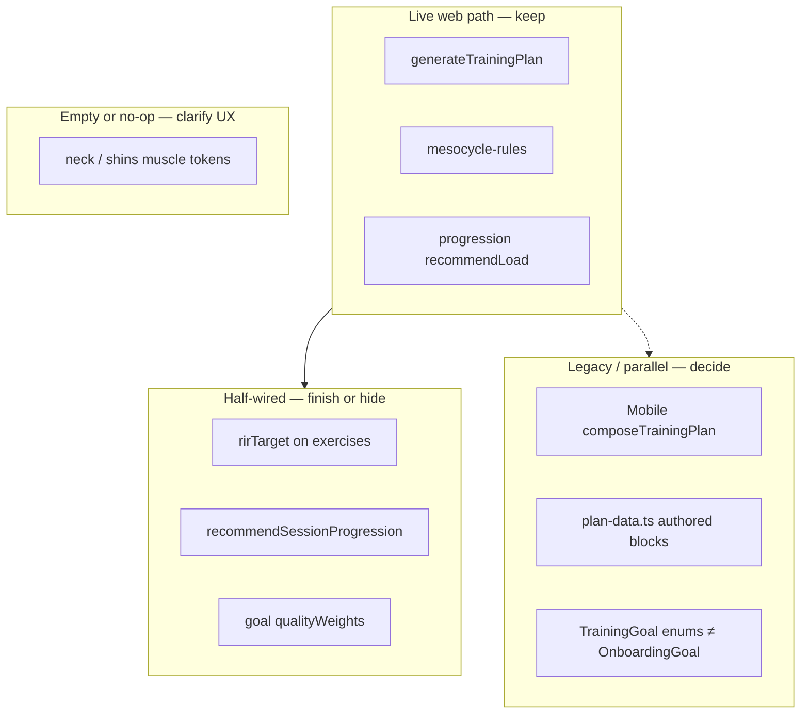

# Debt & cleanup — what looks wrong today

Inventory of leftovers, empty maps, dual systems, and half-wired features after the mesocycle upgrade. Use this for prioritization — **not everything must be deleted tomorrow**, but product owners should know what is real vs decorative.



---

## 1. Dual plan systems (highest confusion)

| | Web AI Plan | Mobile AI Plan screen |
| --- | --- | --- |
| Entry | `generateTrainingPlan` | `composeTrainingPlan` |
| Content | Live exercise catalog | Hard-coded `plan-data.ts` (~760 lines) |
| Goals | `build_muscle`, `lose_weight`, … | `muscle_gain`, `fat_loss`, … |
| Inputs | Full onboarding + equipment | Spec A-1 style (location, weight class, diet…) |

**Why it hurts:** Stakeholders think “the plan” is one product. Engineers ship rules for web; mobile can still show a different, authored program.

**Cleanup options**

1. **Preferred:** Point mobile at `generateTrainingPlan` + shared catalog (parity project).  
2. Or clearly label mobile as “legacy Beta markdown” and stop calling it the same feature.  
3. Do not keep inventing features only in `plan-data.ts`.

---

## 2. Two vocabularies for the same ideas

| Concept | Live onboarding | Legacy enums / composer |
| --- | --- | --- |
| Build muscle | `build_muscle` | `muscle_gain` |
| Fat loss | `lose_weight` | `fat_loss` |
| General | `stay_healthy` | `general_fitness` |
| Experience | 4 levels incl. `no_experience` | 3-level `ExperienceLevel` |

**Cleanup:** One public glossary (see [glossary.md](./glossary.md)); migrate mobile; eventually deprecate `TrainingGoal` for AI Plan or add a single mapping module used everywhere.

---

## 3. Empty muscle tokens (picker options that do nothing)

In `MUSCLE_GROUP_TOKENS`:

```ts
neck: [],
shins: [],
```

These remain on the type for completeness, but **no catalog exercises** map to them.

**Done (web):** pickers and migrate paths use `PLAN_SELECTABLE_MUSCLE_GROUPS` (non-empty tokens only), so neck/shins no longer appear as selectable options.

**Still open:** add real exercises later, or delete the type members entirely once no saved rows reference them.

---

## 4. Half-wired mesocycle features

| Feature | Status | Risk if ignored |
| --- | --- | --- |
| `rirTarget` on main exercises | Written into plan JSON | Users never see week-to-week effort change → “weeks look the same” returns as a ticket |
| `recommendSessionProgression` | Implemented + tested | UI still calls only `recommendLoad` — no repeated-miss / fatigue reassessment in product |
| `GOAL_PROFILES.qualityWeights` | Defined for Functional / General | **Not used** in exercise selection yet — Functional is mostly a parameter profile, not a true quality allocator |
| Exercise roles `PRIMARY`… | Spec’d; code still has `pattern \| isolation \| skill` | Duration trim drops “tail” heuristically, not by formal role |
| Week progression UI cue | Spec’d in design | Overview may still look identical week-to-week without badges/copy |

**Cleanup:** Either ship the UI for RIR + progression copy, or treat those fields as internal until the UI is ready (document “internal only”).

---

## 5. Large authored legacy file still exported

`packages/shared/src/plan/plan-data.ts` (~760 lines) holds `MAIN_BLOCK`, `WARMUP`, diet sections, etc. for `composeTrainingPlan`.

- Still exported from `@pacergo/shared`.  
- Not used by web generation.  
- Easy to edit by mistake thinking it changes web plans.

**Cleanup:** Move under `plan/legacy/` or stop exporting from the package root; gate behind a `legacyPlanComposer` entry.

---

## 6. Retired / odd split options

- `ppl_full_body` — retired UI, still in types for old answers.  
- `ai_custom` — means “recommend for me,” not a literal split.  
- `ppl_upper_body` — special-cased in `focusSequence`.

**Cleanup:** Keep for backwards compatibility, but document in UI as “saved answer compatibility,” not current product options.

---

## 7. Cardio & warm-up edge cases

| Issue | Detail |
| --- | --- |
| Cardio machines live in `cardioTypes`, not `equipment` | Warm-up Raise correctly reads both; easy to break if someone only checks `equipment` |
| Orphan cardio ids | Comments mention hiking/swimming removed from catalog — `cardioTypeToSlug` returns null and skips |
| Raise slug missing from catalog | `byslugs` silently drops it → user gets mobility-only warm-up (safe, but surprising) |
| `treadmill-incline-walk` | Preferred for treadmill Raise; must stay QA-eligible |

---

## 8. QA excluded exercises (intentional, not dead)

`QA_EXCLUDED_EXERCISES` blocks generation until art/instructions are fixed. They still show in the browsable library.

**Not debt** — but product should know the list grows/shrinks with content work. See `exercise-qa.ts`.

---

## 9. Research / reports folders

`research_notes/` and `reports/` hold deep research for the mesocycle work. They are **not** runtime code.

**Cleanup:** Keep; link from this handbook. Do not treat as product docs for clients unless summarized.

---

## 10. Suggested cleanup order (product + eng)

| Priority | Item | Outcome |
| --- | --- | --- |
| P0 | Show week progression / RIR in plan UI | Client can *see* weeks differ |
| P0 | Wire `recommendSessionProgression` or drop from “done” claims | Live engine matches the brief |
| P1 | Hide or implement `neck` / `shins` | No empty picker options |
| P1 | Use or remove `qualityWeights` for Functional | Functional is real or renamed |
| P1 | Mobile → `generateTrainingPlan` or explicitly legacy | One product story |
| P2 | Isolate `plan-data` / `TrainingGoal` | Less engineer foot-guns |
| P2 | Formal exercise roles for trim/substitution | Cleaner duration + stability |

---

## 11. What is *not* debt

- Deterministic generation (feature).  
- Frozen skeleton by default (feature — matches research).  
- `PLAN_RULES_VERSION` + refresh banner (feature).  
- Stretch library separate from strength moves (feature).  
- Empty arrays inside algorithm loops (normal code, not product bugs).

---

## How to verify a “does this do anything?” suspicion

1. Search the id in `packages/shared/src/plan` and `apps/web/src/features/ai-plan`.  
2. If only defined in onboarding types + empty token map → **UI-only / no-op**.  
3. If only in `plan-data.ts` / `plan-composer.ts` → **mobile legacy**.  
4. If written into `GeneratedPlan` but never read in `apps/web` → **half-wired**.  
5. If only in tests → might be intentional API surface; check exports.
