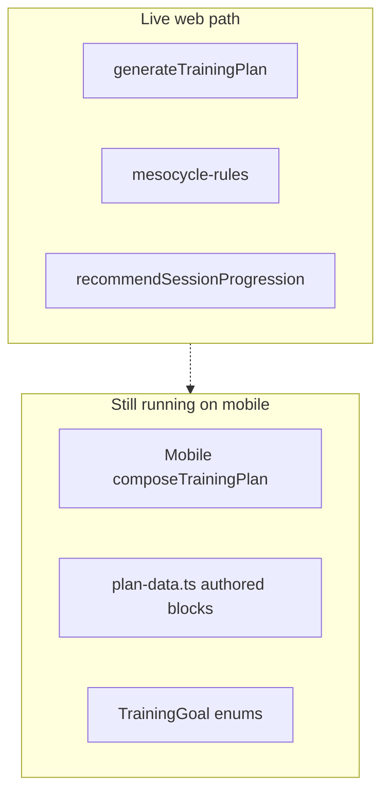

# Debt & cleanup — what looks wrong today

Inventory of leftovers, empty maps, dual systems, and half-wired features after the mesocycle upgrade. Use this for prioritization — **not everything must be deleted tomorrow**, but product owners should know what is real vs decorative.

---

## 1. Dual plan systems (highest confusion)

| | Web AI Plan | Mobile AI Plan screen |
| --- | --- | --- |
| Entry | `generateTrainingPlan` | `composeTrainingPlan` |
| Content | Live exercise catalog | Hard-coded `plan-data.ts` (~760 lines) |
| Goals | `build_muscle`, `lose_weight`, … | `muscle_gain`, `fat_loss`, … |
| Inputs | Full onboarding + equipment | Spec A-1 style (location, weight class, diet…) |

**Why it hurts:** Stakeholders think “the plan” is one product. Engineers ship rules for web; mobile can still show a different, authored program.

**Cleanup options**

1. **Preferred:** Point mobile at `generateTrainingPlan` + shared catalog (parity project).  
2. Or clearly label mobile as “legacy Beta markdown” and stop calling it the same feature.  
3. Do not keep inventing features only in `plan-data.ts`.

---

## 2. Two vocabularies for the same ideas

| Concept | Live onboarding | Legacy enums / composer |
| --- | --- | --- |
| Build muscle | `build_muscle` | `muscle_gain` |
| Fat loss | `lose_weight` | `fat_loss` |
| General | `stay_healthy` | `general_fitness` |
| Experience | Plan answers `no_experience` (Beginner), `basic` (Basic), `intermediate`, `advanced`. A stored plan `beginner` is still read as Basic. Public column `beginner`, `basic`, `intermediate`, `advanced` | Mobile composer offers `beginner`, `intermediate`, `advanced` (`ComposerExperienceLevel`). It does not offer Basic |

**Cleanup:** One public glossary (see [glossary.md](./glossary.md)); migrate mobile; eventually deprecate `TrainingGoal` for AI Plan or add a single mapping module used everywhere.

---

## 3. Empty muscle tokens (picker options that do nothing)

In `MUSCLE_GROUP_TOKENS`, three options map to `[]` because **no catalog exercise has them as its main muscle**: `neck`, `shins`, `hip_flexors`.

**Done:** the catalog's muscle tags now follow the picker where the exercises exist. `refineMainMuscle` in `apps/web/scripts/exercise-seed-entry.ts` splits the broad catalog names by exercise name: lateral raises and upright rows are `middle_delts` (presses stay `shoulders`, the front delt), shrugs are `traps` (not `upper_back`), and the twelve hip-abduction / clamshell / band-walk moves are `abductors` (keeping `glutes` as a second tag). The generator treats middle delts as part of the shoulder slot, traps as upper back and abductors as glutes when filling a session.

**Done (web):** pickers use `PLAN_SELECTABLE_MUSCLE_GROUPS` (non-empty tokens only), and a saved list is cleaned on load by `keepSelectableMuscles`, so a hidden option can't sit in the selection count. A test fails if a shown option has no eligible exercise in the catalog snapshot.

**Still open:** `hip_flexors` has no exercise of its own. The knee- and leg-raise family trains it but is tagged `lower_abs`; retagging would take those moves out of lower-abs priority and exclusion, so it needs a product call. Neck and shins need new exercises.

`lower_back` (3 exercises), `inner_thighs` (2) and `forearms` (5) are thin: they are honoured, but a plan will show the same few moves.

---

## 4. Half-wired mesocycle features

| Feature | Status | Risk if ignored |
| --- | --- | --- |
| Exercise roles `PRIMARY`… | Not built. Code uses `pattern`, `isolation`, `skill` | Duration trim drops the tail of the list, not a named role |
| Week labels in the plan overview | Not built | A flat plan can look the same every week, because the exercises and the reps are the same |

Removed, and not coming back unless a screen asks for them: an effort target on each exercise, goal quality weights, fatigue sensitivity, and a “shorten rest for density” flag. None of those were onboarding questions. The generator never read the three goal fields. The effort target was written into the plan JSON and no screen displayed it.

---

## 5. Large authored legacy file still exported

`packages/shared/src/plan/plan-data.ts` (~760 lines) holds `MAIN_BLOCK`, `WARMUP`, diet sections, etc. for `composeTrainingPlan`.

- Still exported from `@pacergo/shared`.  
- Not used by web generation.  
- Easy to edit by mistake thinking it changes web plans.

**Cleanup:** Move under `plan/legacy/` or stop exporting from the package root; gate behind a `legacyPlanComposer` entry.

---

## 6. Retired / odd split options

- `ppl_full_body` — retired UI, still in types for old answers.  
- `ai_custom` — means “recommend for me,” not a literal split.  
- `ppl_upper_body` — special-cased in `focusSequence`.

**Cleanup:** Keep for backwards compatibility, but document in UI as “saved answer compatibility,” not current product options.

---

## 7. Cardio & warm-up edge cases

| Issue | Detail |
| --- | --- |
| Cardio machines live in `cardioTypes`, not `equipment` | Warm-up Raise correctly reads both; easy to break if someone only checks `equipment` |
| Orphan cardio ids | Comments mention hiking/swimming removed from catalog — `cardioTypeToSlug` returns null and skips |
| Treadmill = running | Only for trained, healthy users. Novices, low-impact mode and BMI < 18.5 get `treadmill-incline-walk`; BMI < 16 gets no cardio block. If the walk slug ever leaves the catalog or fails QA, those users silently lose their cardio block |
| Raise slug missing from catalog | `byslugs` silently drops it → user gets mobility-only warm-up (safe, but surprising) |
| `treadmill-incline-walk` | Preferred for treadmill Raise; must stay QA-eligible |

---

## 8. QA excluded exercises (intentional, not dead)

`QA_EXCLUDED_EXERCISES` blocks generation until art/instructions are fixed. They still show in the browsable library.

**Not debt** — but product should know the list grows/shrinks with content work. See `exercise-qa.ts`.

---

## 9. Inputs collected but not used by generation

Onboarding asks for these; `packages/shared/src/plan` never reads them, so they cannot change a plan. `plan-inputs.ts` leaves them out of the plan fingerprint on purpose.

| Input | Notes |
| --- | --- |
| `activityLevel` | Feeds nutrition only |
| `primaryActivity` (e.g. hiking) | Feeds companion ranking. Generation does not add sport-specific exercises |
| `gender` | Feeds nutrition. `other` yields no calorie target. Generation ignores it |
| Obstacle `low_motivation`, `lack_of_equipment` | Stored. Only `lack_of_time`, `injuries`, `lack_of_knowledge`, `never_tried` change a plan |
| `injuries` | One generic switch → low-impact mode. It is not body-part specific; use *exclude muscles* for a specific area |
| `useCases` | Old saved JSON only. Stripped on load. Not an onboarding question |

**Cleanup:** each is a product decision (use it, or stop asking). Do not wire any of them in speculatively.

---

## 10. Known limits of the safety rails

- Only BMI is used for body-size safety (≥ 30 low-impact, < 18.5 walk-only, < 16 no cardio). Age 50+ is low-impact. There is no onboarding warning or block for a very low weight.
- Basic users can still be given a tier-3 move when nothing easier trains that muscle (a bodyweight-only setup with a pull-up bar gets a pull-up). By design.
- Small bodyweight-only pools repeat: two same-focus days in a week can be near-identical when only a handful of moves fit.
- `ppl_full_body` (retired) on 3 days never reaches its full-body day.

---

## 11. Research / reports folders

`research_notes/` and `reports/` hold the evidence behind the mesocycle work. They are **not** runtime code and they cite each other and the design spec, so they are kept together. The second round (`research_notes/4 week plan rule engine/`) corrects the first round on three points — a mandatory week-4 deload of −40–50% sets, live recovery-gated set adds treated as generation-time law, and a physiologic "week 3 peak" — and the shipped engine follows the second round.

Do not treat them as client-facing product docs unless summarized.

---

## 12. Suggested cleanup order (product + eng)

| Priority | Item | Outcome |
| --- | --- | --- |
| P1 | Mobile → `generateTrainingPlan`, or label the mobile screen as a different, authored plan | One product story |
| P1 | Decide on the inputs in §9 that generation ignores | Stop asking a question that changes nothing, or use the answer |
| P2 | Keep `plan-data` and `TrainingGoal` on the mobile path only | Less chance of editing the wrong plan |
| P2 | Formal exercise roles for trim | Duration cuts follow a named role |

---

## 13. What is *not* debt

- Deterministic generation (feature).
- `recommendSessionProgression` in the set logger (feature).  
- Frozen skeleton by default (feature — matches research).  
- `PLAN_RULES_VERSION` + refresh banner (feature).  
- Stretch library separate from strength moves (feature).  
- Empty arrays inside algorithm loops (normal code, not product bugs).

---

## How to verify a “does this do anything?” suspicion

1. Search the id in `packages/shared/src/plan` and `apps/web/src/features/ai-plan`.  
2. If only defined in onboarding types + empty token map → **UI-only / no-op**.  
3. If only in `plan-data.ts` / `plan-composer.ts` → **mobile legacy**.  
4. If written into `GeneratedPlan` but never read in `apps/web` → **half-wired**.  
5. If only in tests → might be intentional API surface; check exports.
